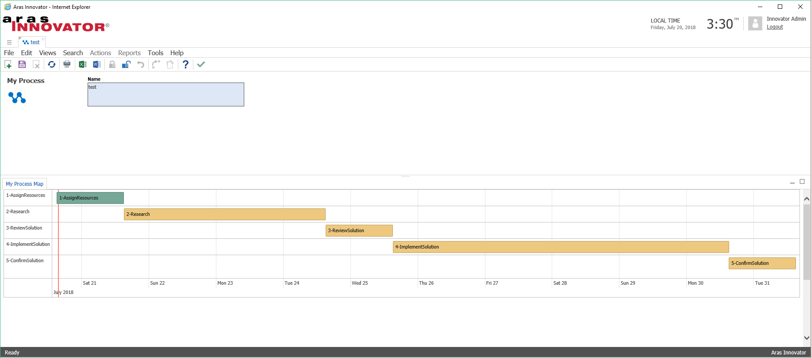

# Workflow Timeline View

This project demonstrates how to implement a timeline view of an item's workflow process. The `labs_WorkflowTimeline` method queries the context item's workflow process and uses Vis.js to display the activities in a timeline. For background on this project, check out the [Display a Workflow as a Timeline Using Vis.js](http://community.aras.com/display-a-workflow-as-a-timeline-using-vis-js/) blog post from Aras Labs.

## History

Release | Notes
--------|--------
[v1.0.0](https://github.com/ArasLabs/workflow-timeline/releases/tag/v1.0.0) | First release.

#### Supported Aras Versions

Project | Aras
--------|------
[v1.0.0](https://github.com/ArasLabs/workflow-timeline/releases/tag/v1.0.0) | 11.0 SP12

> Though built and tested using Aras 11.0 SP12, this project may function in other releases of Aras 11.0.

## Installation

#### Important!
**Always back up your code tree and database before applying an import package or code tree patch!**

### Pre-requisites

1. Aras Innovator installed (version 11.0 SP12)
2. Aras Package Import Utility
3. aras.labs.WorkflowTimeline package
4. Code Tree overlay

### Install Steps

#### The Code Tree
1. Backup your code tree and store the backup in a safe place.
2. Copy the `/Innovator/` folder in your local repository.
3. Paste this folder to the root of your code tree.
	* This should be the same folder that contains the `InnovatorServerConfig.xml`.

#### The Database
1. Backup your database and store the BAK file in a safe place.
2. Open up the Aras Package Import tool.
3. Enter your login credentials and click **Login**
    * _Note: You must login as root for the package import to succeed!_
4. Enter the package name in the TargetRelease field.
    * Optional: Enter a description in the Description field.
5. Enter the path to your local `..\workflow-timeline\Import\imports.mf` file in the Manifest File field.
6. Select the following in the Available for Import field.
    * **aras.labs.WorkflowTimeline**
7. Select Type = **Merge** and Mode = **Thorough Mode**.
8. Click **Import** in the top left corner.
9. Close the Aras Package Import tool.

You are now ready to login to Aras and check out the identity map.

## Usage

### 1. Check Out the Sample ItemType

This project's import package includes a sample ItemType called "My Process" that is configured with a workflow and timeline view. This is a great way to dive in and play with the code in a development environment. It is not recommended to use this ItemType as the basis for an actual ItemType in your data model.

1. Login to Aras Innovator as admin.
2. Navigate to **My Innovator > My Processes** in the TOC.
3. Create a new My Process item and save it.


*The "My Process Map" tab will display a timeline view of the new item's workflow process.*

>Note: A bug currently prevents the process map from displaying immediately after a new My Process item is created. If the timeline doesn't appear as shown in the screenshot above, close and reopen the item.

### 2. Configure the View on Your ItemType

The labs_WorkflowTimeline method can be reused for multiple ItemTypes. Once you've applied the project's code tree overlay and import package, follow the steps below to add a timeline view to your own ItemTypes.

> Note: The initial version of this project relies on the Activity names to correctly display the order of "pending" Activities in the timeline. This requirement will be resolved in a future release of the project. For additional information about this and other limitations of this release, check out the [issues page](https://github.com/ArasLabs/workflow-timeline/issues).

#### Configuring the Relationship Tab
1. Create a new null RelationshipType on the parent ItemType.
2. Save the parent ItemType, then open and lock the RelationshipType.
3. Open the Relationship View tab on the RelationshipType.
4. Click the Pick Related button and select the identity that should be able to see the Gantt-like view.
5. In the Form field, select the default Form that was created with your new RelationshipType.
6. Save the RelationshipType, then open and lock the Form.

#### Configuring the Form
1. In the Form, add a new HTML field with the following contents.
    ```(javascript)
    <style>
    #visualization {
        height: 600px; 
        width: 1800px;
    }
    .vis-item.active {
        background-color: #76A797;
        border-color: #5E8579;
    }
    .vis-item.pending {
        background-color: #EDC87E;
        border-color: #BDA064;
    }
    </style>
    <div id="visualization"> </div>
    ```
2. Under the Field Label tab, delete the Label of the new field so it won't appear in the tab content.
3. Remove the default item_info Field.
4. Select the Form Body tab and add the following to the CSS field.
    ```(css)
    @import "../javascript/visjs/dist/vis-timeline-graph2d.min.css"
    ```
5. Select the Form Event tab and then select Pick Related and click the New Relationship button.
6. In the search dialog that appears, select the labs_WorkflowTimeline method.
7. In the new Form Event row, select OnLoad from the Event dropdown list.
8. Save and close the form.

#### Viewing the Timeline
1. In the TOC, navigate to the ItemType you added the timeline view to.
2. Run a search and open an item. 

## Contributing

1. Fork it!
2. Create your feature branch: `git checkout -b my-new-feature`
3. Commit your changes: `git commit -am 'Add some feature'`
4. Push to the branch: `git push origin my-new-feature`
5. Submit a pull request

For more information on contributing to this project, another Aras Labs project, or any Aras Community project, shoot us an email at araslabs@aras.com.

## Credits

Created by Yoann Maingon and Eli Donahue from Aras Labs. 

The timeline rendering is created using [Vis.js](http://visjs.org). Check out the [docs](http://visjs.org/docs/timeline) and [samples](http://visjs.org/timeline_examples.html) for more info on customizing the view.

## License

Aras Labs projects are published to Github under the MIT license. See the [LICENSE file](./LICENSE.md) for license rights and limitations.